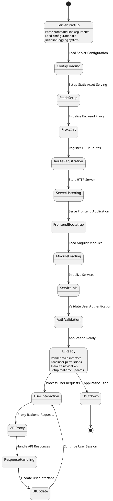

# XConf UI Component Documentation

The XConf UI is a comprehensive web-based administration interface for the XConf configuration management ecosystem. It serves as the primary user interface for managing RDK device configurations, firmware rules, feature controls, device settings, telemetry profiles, and system administration functions. The UI component acts as a bridge between administrators and the XConf Admin backend service, providing an intuitive and responsive interface for complex configuration management tasks.

The XConf UI integrates seamlessly with the XConf Admin service through a proxy architecture, enabling real-time configuration management, rule creation and modification, system monitoring, and comprehensive reporting capabilities. It serves as the central control panel for all administrative functions in large-scale RDK deployments.

**Key Features & Responsibilities**:

- **Comprehensive Configuration Management Interface**: Full-featured web interface for all XConf configuration operations including firmware, DCM, RFC, and telemetry management
- **Real-Time Proxy Architecture**: Seamless integration with XConf Admin backend through intelligent request proxying and response handling
- **Modular Angular Application**: Component-based architecture supporting firmware management, feature control, device settings, and telemetry configuration
- **Advanced Rule Builder**: Intuitive interface for creating and managing complex configuration rules with conditional logic and priority handling
- **Interactive Testing and Validation**: Built-in test pages for validating configuration rules and testing device scenarios
- **Comprehensive Reporting and Analytics**: Detailed reporting interfaces for system statistics, penetration data, and configuration change logs
- **Role-Based Access Control**: Integration with authentication systems supporting granular permission management
- **Responsive Design**: Modern web interface optimized for desktop and tablet administration workflows

## Design

The XConf UI follows a modern three-tier architecture combining a lightweight Go-based HTTP server with a sophisticated AngularJS frontend application. The design emphasizes separation of concerns through a proxy pattern where the Go server handles static asset serving, authentication integration, and request proxying while the AngularJS application manages complex user interactions, data visualization, and configuration workflows.

The architecture prioritizes maintainability through modular component design, where each configuration domain (firmware, DCM, RFC, telemetry) is implemented as independent Angular modules with shared services and common UI components. The proxy pattern enables seamless backend integration while maintaining frontend flexibility for UI enhancements and user experience improvements.

### Prerequisites and Dependencies

**MUST Requirements:**
- Node.js v24.1.0+ for frontend development and build processes
- NPM 11.3.0+ for dependency management and build automation
- Go 1.19+ runtime environment for HTTP server and proxy functionality
- XConf Admin backend service for API operations and data management
- Modern web browser with JavaScript support (Chrome, Firefox, Safari, Edge)

**SHOULD Requirements:**
- Grunt build system for frontend asset compilation and optimization
- Bower package manager for frontend dependency management
- HTTP/2 capable web server infrastructure for optimal performance
- Content Delivery Network (CDN) for static asset distribution in production deployments

**External Dependencies:**
- AngularJS 1.x framework for frontend application structure
- Bootstrap UI components for responsive design and user interface elements
- Angular-specific libraries (ngTable, ngResource, toastr, etc.) for enhanced functionality
- Build tools (Grunt, Bower) for development workflow and asset optimization

```
┌─────────────────────────────────────────────────────────────┐
│                 Web Browser Environment                     │
├─────────────────────────────────────────────────────────────┤
│                 AngularJS Application                       │
│  ┌─────────────┐ ┌─────────────┐ ┌─────────────────────┐   │
│  │ Firmware    │ │    DCM      │ │       RFC           │   │
│  │ Management  │ │ Management  │ │   Management        │   │
│  │     UI      │ │     UI      │ │       UI            │   │
│  └─────────────┘ └─────────────┘ └─────────────────────┘   │
│  ┌─────────────┐ ┌─────────────────────────────────────┐   │
│  │ Telemetry   │ │    Shared Services &                │   │
│  │ Management  │ │      Components                     │   │
│  │     UI      │ │                                     │   │
│  └─────────────┘ └─────────────────────────────────────┘   │
└───────────────────────┬─────────────────────────────────────┘
                        │ HTTP Requests
                        ▼
┌─────────────────────────────────────────────────────────────┐
│                  Go HTTP Server                             │
├─────────────────────────────────────────────────────────────┤
│  ┌─────────────┐ ┌─────────────┐ ┌─────────────────────┐   │
│  │   Static    │ │   Backend   │ │   Authentication    │   │
│  │   Asset     │ │    Proxy    │ │      Handler        │   │
│  │  Handler    │ │   Handler   │ │                     │   │
│  └─────────────┘ └─────────────┘ └─────────────────────┘   │
│  ┌─────────────┐                                           │
│  │   Health    │                                           │
│  │   Check     │                                           │
│  │  Handler    │                                           │
│  └─────────────┘                                           │
└───────────────────────┬─────────────────────────────────────┘
                        │ Proxy Requests
                        ▼
┌─────────────────────────────────────────────────────────────┐
│               XConf Admin Service                           │
├─────────────────────────────────────────────────────────────┤
│                  Admin REST API                             │
│         (Firmware, DCM, RFC, Telemetry APIs)               │
└─────────────────────────────────────────────────────────────┘
```

## Component State Flow

### Application Initialization and Bootstrap

The XConf UI initializes through a multi-phase startup process beginning with Go server configuration loading, static asset preparation, and proxy service setup. The frontend AngularJS application then bootstraps with module loading, service initialization, and user authentication validation.



**Alternative ASCII Flow Representation:**
```
START
  │
  ▼
┌─────────────────┐     ┌─────────────────┐     ┌─────────────────┐
│  Server Startup │────▶│ Config Loading  │────▶│  Static Setup   │
│ • Parse args    │     │ • Load config   │     │ • Setup assets  │
│ • Init logging  │     │ • Validate      │     │ • Prepare files │
└─────────────────┘     └─────────────────┘     └─────────────────┘
                                                          │
                                                          ▼
┌─────────────────┐     ┌─────────────────┐     ┌─────────────────┐
│    UI Ready     │◀────│ Auth Validation │◀────│   Proxy Init    │
│ • Load UI       │     │ • Check auth    │     │ • Setup proxy   │
│ • Load perms    │     │ • Load session  │     │ • Register routes│
└─────────────────┘     └─────────────────┘     └─────────────────┘
         │
         ▼
┌─────────────────────────────────────────────────────────────────┐
│                    Runtime Loop                                 │
│  User Interaction ──▶ API Proxy ──▶ Response ──▶ UI Update     │
│         ▲                                             │         │
│         └─────────────────────────────────────────────┘         │
└─────────────────────────────────────────────────────────────────┘
         │
         ▼
      SHUTDOWN
```

### User Session Management and Request Flow

The UI maintains user session state through authentication integration while providing real-time interaction with the backend through the proxy layer. The system handles concurrent user operations, form validation, and error handling with comprehensive user feedback mechanisms.

**State Change Triggers:**
- User authentication events trigger permission loading and UI customization
- Configuration changes trigger form validation and backend synchronization
- Navigation events cause module loading and view state transitions
- Backend errors trigger user notification and graceful error recovery

**Session Management Scenarios:**
- Login/logout operations manage authentication state and session cleanup
- Permission changes trigger UI element visibility and functionality updates  
- Configuration modifications require validation, confirmation, and audit logging
- Real-time updates from backend trigger UI refresh and notification display

## Internal Modules

The XConf UI is organized into specialized Angular modules, each responsible for specific configuration management domains with shared infrastructure for common functionality, navigation, and backend communication.

| Module/Domain | Description | Key Components |
|--------------|-------------|----------------|
| **Firmware Management** | Complete firmware configuration, rule management, and deployment control | `app.firmwareconfig`, `app.firmwarerule`, `app.firmwareruletemplate` |
| **Device Control Manager (DCM)** | DCM formula management, device settings, log upload policies, and VOD configurations | `app.formula`, `app.devicesettings`, `app.loguploadsettings`, `app.vodsettings` |
| **Feature Control (RFC)** | Feature flag management, rule configuration, and percentage-based rollout controls | `app.feature`, `app.featurerule` |
| **Telemetry Management** | Telemetry profile configuration, targeting rules, and data collection policies | `app.permanentprofile`, `app.telemetrytwoprofile`, `app.targetingrule` |
| **System Administration** | Environment management, model configuration, namespace lists, and user authorization | `app.environment`, `app.model`, `app.namespacedlist`, `app.authorization` |
| **Testing and Validation** | Interactive test pages for validating configuration rules and device scenarios | `app.testpage`, `app.telemetryTestPage`, `app.firmwareTestPage` |
| **Reporting and Analytics** | Statistics, change logs, penetration data, and system monitoring interfaces | `app.statistics`, `app.changeLog`, `app.firmwareReportPage` |
| **Core Infrastructure** | Shared services, filters, directives, and common UI components | `app.core`, `app.services`, `app.filters`, `app.directives` |

```
XConf UI Application Module Architecture
═══════════════════════════════════════

                    ┌─────────────────┐
                    │  Core Services  │
                    │   & Common UI   │
                    └─────────┬───────┘
                              │ (provides base services)
              ┌───────────────┼───────────────┐
              │               │               │
              ▼               ▼               ▼
    ┌─────────────────┐ ┌─────────────┐ ┌─────────────────┐
    │   Firmware      │ │     DCM     │ │      RFC        │
    │  Management     │ │ Management  │ │  Management     │
    │                 │ │             │ │                 │
    │ • Config CRUD   │ │ • Formulas  │ │ • Features      │
    │ • Rules         │ │ • Settings  │ │ • Rules         │
    │ • Templates     │ │ • Log Upload│ │ • Rollouts      │
    └─────────────────┘ └─────────────┘ └─────────────────┘
              │               │               │
              ▼               ▼               ▼
    ┌─────────────────┐ ┌─────────────┐ ┌─────────────────┐
    │   Telemetry     │ │   System    │ │  Testing &      │
    │  Management     │ │    Admin    │ │  Validation     │
    │                 │ │             │ │                 │
    │ • Profiles      │ │ • Env/Model │ │ • Test Pages    │
    │ • Targeting     │ │ • Users     │ │ • Simulators    │
    │ • T2 Profiles   │ │ • Lists     │ │ • Debuggers     │
    └─────────────────┘ └─────────────┘ └─────────────────┘
              │               │               │
              └───────────────┼───────────────┘
                              ▼
                    ┌─────────────────┐
                    │  Reporting &    │
                    │   Analytics     │
                    │                 │
                    │ • Statistics    │
                    │ • Change Logs   │
                    │ • Penetration   │
                    └─────────────────┘
```

## API Integration and Proxy Architecture

### Backend API Proxy Configuration

The XConf UI implements a comprehensive proxy architecture that seamlessly routes frontend requests to the XConf Admin backend service while maintaining session state, authentication context, and error handling.

**Proxied API Endpoints**:

#### Authentication and Authorization
- `GET /provider` - Authentication provider configuration
- `POST /auth/*` - Authentication operations
- `GET /acl/auth` - Access control validation

#### Configuration Management
- `GET/POST/PUT/DELETE /firmwareconfig/*` - Firmware configuration CRUD operations
- `GET/POST/PUT/DELETE /firmwarerule/*` - Firmware rule management
- `GET/POST/PUT/DELETE /firmwareruletemplate/*` - Firmware rule template operations
- `GET/POST/PUT/DELETE /model/*` - Device model management
- `GET/POST/PUT/DELETE /environment/*` - Environment configuration

#### Device Control Manager (DCM)
- `GET/POST/PUT/DELETE /dcm/*` - DCM formula and settings management
- `GET/POST/PUT/DELETE /setting/*` - Device settings configuration
- `GET/POST/PUT/DELETE /settings/*` - Settings profile management

#### Feature Control (RFC)
- `GET/POST/PUT/DELETE /rfc/*` - RDK Feature Control management
- Feature rule configuration and targeting operations

#### Telemetry Services
- `GET/POST/PUT/DELETE /telemetry/*` - Telemetry profile management
- `GET/POST/PUT/DELETE /telemetrytwo/*` - Telemetry 2.0 configuration
- Targeting rule and test page operations

#### System Operations
- `GET/POST/PUT/DELETE /genericnamespacedlist/*` - Namespace list management
- `GET/POST/PUT/DELETE /percentfilter/*` - Percentage filter configuration
- `GET/POST/PUT/DELETE /roundrobinfilter/*` - Round-robin filter management
- `GET /reportpage/*` - Report generation and analytics
- `GET /log/*` - System log access and management
- `GET /stats/*` - System statistics and metrics
- `GET /penetrationdata/*` - Penetration testing data
- `GET/POST /config/*` - Configuration management operations
- `GET/POST/PUT/DELETE /lockdownsettings/*` - Security lockdown settings

### Proxy Request Processing Flow

```
Proxy Request Processing Flow
════════════════════════════

User Browser          XConf UI Server          XConf Admin API
     │                        │                        │
     │ GET /firmwareconfig     │                        │
     ├───────────────────────▶│                        │
     │                        │                        │
     │                        │ Add X-Request-ID       │
     │                        │ header: "adminui"      │
     │                        │                        │
     │                        │ Proxy Request          │
     │                        ├───────────────────────▶│
     │                        │                        │
     │                        │                        │ Process request
     │                        │                        │ with business logic
     │                        │                        │
     │                        │ API Response           │
     │                        │◀───────────────────────┤
     │                        │                        │
     │                        │ Process response       │
     │                        │ (logging, error        │
     │                        │  handling)             │
     │                        │                        │
     │ JSON Response          │                        │
     │◀───────────────────────┤                        │
     │                        │                        │

Note: Authentication context is maintained throughout the proxy chain
      All requests include proper session and security headers
```

### Static Asset Management

The UI server provides optimized static asset serving for the frontend application:

#### Frontend Application Routes
- `GET /app/compiled/*` - Compiled and optimized JavaScript/CSS assets
- `GET /app/landing/*` - Landing page components and assets
- `GET /app/shared/*` - Shared UI components and libraries
- `GET /app/xconf/*` - XConf-specific application modules

#### Static Resources
- `GET /img/*` - Image assets and icons
- `GET /` - Main application index page (served via template rendering)

#### Health and Monitoring Endpoints
- `GET /monitor` - Basic health check endpoint
- `GET /healthz` - Kubernetes-style health check
- `GET /version` - Application version and build information
- `GET /config` - Server configuration details (admin access)

## User Interface Components

### Firmware Management Interface

#### Firmware Configuration Management
**Purpose**: Complete lifecycle management of firmware configurations including version control, model support, and distribution protocols.

**Key Features**:
- Firmware configuration CRUD operations with version tracking
- Model compatibility matrix management
- Download protocol configuration (HTTP/HTTPS/TFTP)
- IPv6 support configuration
- Mandatory update flags and upgrade delay settings

**User Workflow**:
1. Navigate to Firmware Configuration section
2. Create/edit firmware configuration with version, filename, and supported models
3. Configure download URLs and protocols
4. Set reboot and upgrade policies
5. Validate and save configuration

#### Firmware Rule Management
**Purpose**: Advanced rule-based firmware deployment with conditional logic and targeting capabilities.

**Key Features**:
- Complex rule builder with conditional expressions
- Environment and model-based targeting
- Priority-based rule evaluation
- IP address group targeting
- Rule template system for common patterns

**User Workflow**:
1. Access Firmware Rules management interface
2. Create rule with targeting conditions (model, environment, MAC patterns)
3. Associate firmware configuration with rule
4. Set rule priority and activation status
5. Test rule logic with validation tools

#### Percentage Filters and Canary Deployments
**Purpose**: Gradual firmware rollout with percentage-based deployment control.

**Key Features**:
- Percentage-based firmware distribution
- Whitelist and blocked device management
- Real-time rollout monitoring and control
- Emergency rollback capabilities

### Device Control Manager (DCM) Interface

#### DCM Formula Management
**Purpose**: Rule-based device control policies with sophisticated targeting and priority management.

**Key Features**:
- Formula creation with conditional logic builder
- Device settings association and management
- Log upload policy configuration
- VOD settings integration
- Priority-based formula evaluation

#### Device Settings Configuration
**Purpose**: Comprehensive device-level configuration management including schedules, URLs, and operational parameters.

**Key Features**:
- Configuration service URL management
- Reboot schedule configuration
- Check-on-reboot policy settings
- Time zone and schedule management
- Active/inactive status control

#### Log Upload Settings
**Purpose**: Centralized log collection policy management with repository configuration and upload scheduling.

**Key Features**:
- Log upload repository configuration
- Upload frequency and retention policies
- Log type and category management
- Bandwidth and timing controls
- Repository URL and protocol settings

### Feature Control (RFC) Interface

#### Feature Management
**Purpose**: Comprehensive feature flag management with conditional activation and configuration parameter control.

**Key Features**:
- Feature definition and configuration
- Parameter management with data type support
- Feature group organization and categorization
- Activation status and default value configuration

#### Feature Rule Configuration
**Purpose**: Advanced targeting and rollout control for feature activation with percentage-based distribution.

**Key Features**:
- Rule-based feature targeting with conditional logic
- Percentage rollout configuration and monitoring
- Device cohort targeting (model, environment, firmware version)
- Feature parameter override capabilities
- Priority-based rule evaluation and conflict resolution

### Telemetry Management Interface

#### Telemetry Profile Management
**Purpose**: Comprehensive telemetry data collection configuration with flexible profile management and targeting capabilities.

**Key Features**:
- Telemetry profile creation and editing
- Data collection parameter configuration
- Upload schedule and frequency management
- Repository configuration and protocol selection
- Profile activation and status management

#### Targeting Rule Configuration
**Purpose**: Advanced targeting system for telemetry profile distribution with device-specific targeting capabilities.

**Key Features**:
- Rule-based profile targeting with conditional expressions
- Device cohort targeting (MAC patterns, models, environments)
- Time-based activation and scheduling
- Priority management for overlapping rules

### System Administration Interface

#### Environment and Model Management
**Purpose**: Foundational configuration management for deployment environments and device models.

**Key Features**:
- Environment definition and configuration
- Model management with capability definition
- Environment-model relationship management
- Deployment pipeline configuration

#### Namespace List Management
**Purpose**: Centralized list management for MAC addresses, IP addresses, and other system identifiers.

**Key Features**:
- Generic namespace list creation and management
- MAC address list management with pattern support
- IP address and CIDR range management
- Import/export functionality for bulk operations

### Testing and Validation Interface

#### Interactive Test Pages
**Purpose**: Comprehensive testing framework for validating configuration rules and simulating device scenarios.

**Test Page Categories**:

1. **Firmware Test Page**
   - Simulate firmware requests with device parameters
   - Test firmware rule evaluation and targeting
   - Validate firmware configuration responses
   - Debug rule logic and priority conflicts

2. **DCM Test Page**
   - Test DCM formula evaluation with device context
   - Validate device settings delivery
   - Test log upload policy application
   - Debug formula priority and targeting logic

3. **RFC Test Page**
   - Simulate feature control requests
   - Test feature rule evaluation and percentage rollouts
   - Validate feature configuration responses
   - Debug feature targeting and activation logic

4. **Telemetry Test Page**
   - Test telemetry profile targeting and delivery
   - Validate profile rule evaluation
   - Test upload schedule and repository configuration
   - Debug profile priority and activation logic

**Common Test Features**:
- Device parameter simulation (MAC, model, environment, firmware version)
- Real-time rule evaluation and result display
- Configuration response preview and validation
- Rule debugging with step-by-step evaluation traces
- Performance metrics and response time analysis

## User Authentication and Authorization

### Authentication Integration

The XConf UI integrates with enterprise authentication systems through the XConf Admin backend, supporting multiple authentication providers and session management strategies.

**Authentication Flow**:
1. User accesses UI application
2. Authentication status validated through `/auth/info` endpoint
3. Redirect to configured identity provider if not authenticated
4. Post-authentication callback processing and session establishment
5. Permission loading and UI customization based on user roles

**Supported Authentication Methods**:
- **Enterprise Identity Providers**: SAML, OAuth 2.0, OpenID Connect integration
- **Basic Authentication**: Username/password authentication for development environments
- **Certificate-Based Authentication**: X.509 certificate validation for high-security deployments
- **Session-Based Authentication**: Persistent session management with configurable timeouts

### Authorization and Access Control

The UI implements granular permission-based access control with role-based restrictions on functionality and data access.

**Permission Levels**:
- **Read-Only Access**: View configurations and system status without modification capabilities
- **Configuration Management**: Create, modify, and delete configuration entities with audit logging
- **System Administration**: Full system access including user management and system configuration
- **Test and Validation**: Access to test pages and validation tools for configuration testing

**Entity-Based Permissions**:
- Firmware configuration and rule management permissions
- DCM formula and device settings access control
- RFC feature and rule management authorization
- Telemetry profile and targeting rule permissions
- System administration and user management access

## Performance Optimization and User Experience

### Frontend Performance Strategies

#### Asset Optimization
- **Minification and Compression**: JavaScript and CSS assets are minified and compressed for optimal loading
- **Lazy Loading**: Angular modules are loaded on-demand to reduce initial application load time
- **Caching Strategy**: Static assets are cached with appropriate cache headers for improved performance
- **CDN Integration**: Static assets can be served through Content Delivery Networks for global performance

#### User Interface Responsiveness
- **Asynchronous Operations**: All backend API calls are asynchronous with loading indicators and progress feedback
- **Pagination and Filtering**: Large data sets use client-side and server-side pagination with advanced filtering
- **Real-Time Updates**: WebSocket or polling-based updates for real-time configuration change notifications
- **Optimistic UI Updates**: Immediate UI feedback for user actions with backend confirmation

### Backend Proxy Optimization

#### Request Handling Efficiency
- **Connection Pooling**: HTTP connection reuse for backend API communication
- **Request Batching**: Multiple related API calls are batched when possible to reduce network overhead
- **Response Caching**: Appropriate caching of backend responses for frequently accessed data
- **Circuit Breaker Pattern**: Graceful degradation when backend services are unavailable

## Deployment and Configuration Management

### Development Environment Setup

#### Prerequisites Installation
```bash
# Install Node.js and NPM
# Install dependencies
npm install

# Install Bower dependencies
npm run install
# or
bower install

# Build frontend assets
grunt install
```

#### Configuration File Setup
The UI server requires proper configuration for backend integration and operational settings:

```hocon
xconfadminui {
    server {
        port = ":8081"
        web_root = "."
    }
    
    webconfigadmin {
        host = "http://localhost:9001/xconfAdminService"
    }
    
    log {
        level = "debug"
        file = "/app/logs/xconfadminui/xconfadminui.log"
        set_report_caller = true
    }
}
```

### Production Deployment Considerations

#### High Availability Configuration
- **Load Balancer Integration**: Multiple UI server instances behind load balancers
- **Session Affinity**: Proper session management for multi-instance deployments
- **Health Check Configuration**: Integration with load balancer health checking
- **Graceful Shutdown**: Proper connection draining during deployments

#### Security Hardening
- **HTTPS Enforcement**: TLS encryption for all client communications
- **Security Headers**: Implementation of security headers (HSTS, CSP, X-Frame-Options)
- **Content Security Policy**: Strict CSP implementation for XSS protection
- **Input Sanitization**: Comprehensive input validation and sanitization

#### Performance Optimization
- **Static Asset Compression**: Gzip compression for all static assets
- **Browser Caching**: Appropriate cache headers for optimal browser caching
- **CDN Integration**: Content delivery network integration for global performance
- **Resource Minification**: Minified and optimized JavaScript and CSS assets

## Monitoring and Observability

### Application Health Monitoring

#### Health Check Endpoints
The UI server exposes comprehensive health check endpoints for monitoring and alerting:

- **Basic Health Check** (`/monitor`): Simple endpoint for basic availability monitoring
- **Kubernetes Health Check** (`/healthz`): Kubernetes-compatible liveness and readiness probes  
- **Detailed Health Check**: Comprehensive validation including backend connectivity and dependencies

#### Performance Metrics
- **Response Time Monitoring**: Frontend and backend API response time tracking
- **User Session Metrics**: Active user sessions, authentication success rates, and session duration
- **Error Rate Tracking**: Frontend JavaScript errors, backend API errors, and user-reported issues
- **Resource Utilization**: Memory usage, CPU utilization, and network bandwidth consumption

### User Experience Monitoring

#### Frontend Performance Tracking
- **Page Load Times**: Complete page load performance measurement and optimization
- **User Interaction Metrics**: Click-through rates, form completion rates, and user flow analysis
- **Error Tracking**: JavaScript error monitoring with stack traces and user context
- **Browser Compatibility**: Cross-browser performance and compatibility monitoring

#### Backend Integration Monitoring
- **API Response Times**: Detailed tracking of backend API performance and availability
- **Proxy Performance**: Request proxying latency and error rate monitoring
- **Authentication Performance**: Login/logout performance and authentication provider response times
- **Data Synchronization**: Real-time monitoring of configuration change propagation

This comprehensive documentation provides complete coverage of the XConf UI component, its architecture, functionality, and operational characteristics. The UI serves as the primary administrative interface for the XConf ecosystem, enabling efficient management of complex RDK device configurations through an intuitive and powerful web-based interface.